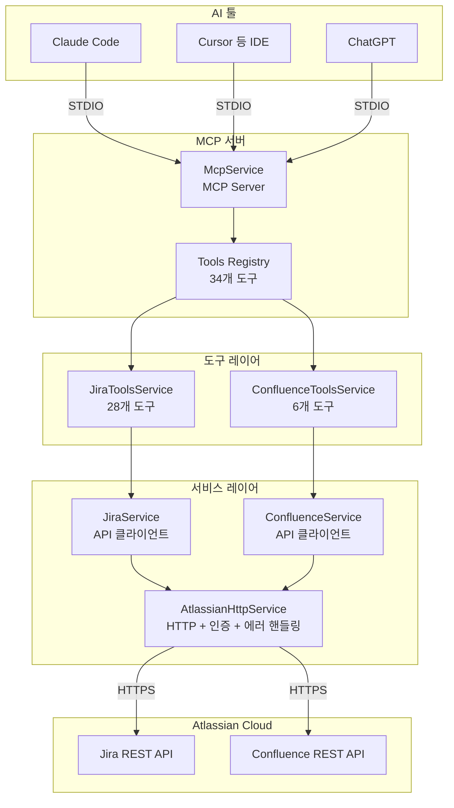

# Local MCP Atlassian

NestJS 기반 MCP(Model Context Protocol) 서버 - Jira & Confluence 연동

## 개요

Claude Code, Cursor, ChatGPT 등 AI 툴이 Jira/Confluence와 직접 연동할 수 있도록 해주는 MCP(Model Context Protocol) 서버입니다. 검증된 오픈소스 프로젝트도 있으나 혹시 모를 보안 문제 때문에 자체적으로 구현했습니다. 기능 종류는 오픈소스 프로젝트들을 취합하였습니다.

### MCP 서버란?

MCP(Model Context Protocol)는 AI 툴이 외부 시스템과 상호작용할 수 있도록 하는 표준 프로토콜입니다. 이 서버는 MCP SDK를 사용하여 Jira와 Confluence API를 도구(Tools)로 노출시킵니다.

**작동 방식:**
1. AI 툴(Claude Code, Cursor, ChatGPT 등)이 MCP 서버에 연결
2. 서버는 사용 가능한 도구 목록을 제공 (예: `jira_search`, `jira_create_issue` 등)
3. AI가 사용자 요청에 따라 적절한 도구를 호출
4. 서버는 Atlassian API를 호출하고 결과를 AI에게 반환

**제공하는 도구:**
- **Jira 도구 28개**: 이슈 검색/생성/수정/삭제, 상태 변경, 댓글 관리, 이슈 연결, 메타데이터 조회, 대량 생성, Agile 보드/스프린트 관리, 작업 로그, 이슈 복제 등
- **Confluence 도구 6개**: 페이지 검색/생성/수정/삭제, 댓글 조회 등

이를 통해 AI 툴이 자연어로 "PROJ-123 이슈를 진행 중으로 변경해줘"라고 요청하면, 서버가 자동으로 해당 이슈의 상태를 변경할 수 있습니다.

## 초기 설정

```bash
cp SETUP.example.md SETUP.md
cp .env.example .env
```

`SETUP.md`의 가이드를 따라 환경변수와 프로젝트 목록을 설정하세요.

티켓 작성 규칙은 [docs/JIRA_GUIDE.md](docs/JIRA_GUIDE.md) 참고

## 기능

### Jira - 기본

| 도구 | 설명 |
|------|------|
| `jira_search` | JQL로 이슈 검색 |
| `jira_get_issue` | 이슈 상세 조회 |
| `jira_create_issue` | 이슈 생성 (assignee, priority, labels 지원) |
| `jira_update_issue` | 이슈 수정 |
| `jira_delete_issue` | 이슈 삭제 |
| `jira_transition_issue` | 이슈 상태 변경 |
| `jira_add_comment` | 댓글 추가 |
| `jira_get_comments` | 댓글 목록 조회 |
| `jira_delete_comment` | 댓글 삭제 |

### Jira - 연결 및 메타데이터

| 도구 | 설명 |
|------|------|
| `jira_create_issue_link` | 이슈 연결 (blocks, relates 등) |
| `jira_remove_issue_link` | 이슈 연결 해제 |
| `jira_get_link_types` | 링크 타입 목록 조회 |
| `jira_get_all_projects` | 전체 프로젝트 목록 |
| `jira_get_statuses` | 상태 목록 조회 |
| `jira_get_issue_types` | 이슈 타입 목록 (Task, Bug, Story 등) |
| `jira_get_priorities` | 우선순위 목록 (Highest~Lowest) |
| `jira_get_transitions` | 이슈별 가능한 상태 전환 목록 |

### Jira - 대량 작업 및 Agile

| 도구 | 설명 |
|------|------|
| `jira_bulk_create_issues` | 이슈 대량 생성 (최대 50개) |
| `jira_get_my_issues` | 현재 사용자에게 할당된 이슈 조회 |
| `jira_get_boards` | Scrum/Kanban 보드 목록 조회 |
| `jira_get_sprints` | 보드의 스프린트 목록 조회 |
| `jira_get_sprint_issues` | 스프린트 내 이슈 조회 |
| `jira_move_to_sprint` | 이슈를 스프린트로 이동 |

### Jira - 작업 로그 및 유틸리티

| 도구 | 설명 |
|------|------|
| `jira_get_worklog` | 이슈의 작업 로그 조회 |
| `jira_log_work` | 작업 시간 기록 |
| `jira_get_project_summary` | 프로젝트 요약 (상태별 이슈 수) |
| `jira_clone_issue` | 이슈 복제 |
| `jira_assign_to_me` | 이슈를 현재 사용자에게 할당 |

### Confluence

| 도구 | 설명 |
|------|------|
| `confluence_search` | CQL로 페이지 검색 |
| `confluence_get_page` | 페이지 조회 |
| `confluence_create_page` | 페이지 생성 |
| `confluence_update_page` | 페이지 수정 |
| `confluence_delete_page` | 페이지 삭제 |
| `confluence_get_comments` | 페이지 댓글 조회 |

## 주의사항

- 댓글에서 `(/)`, `(x)` 같은 위키 마크업 이모티콘은 Jira Cloud ADF에서 자동 변환되지 않음
  - 직접 이모지 사용 권장: ✅, ❌, ⚠️
- assignee는 이메일 또는 accountId 모두 사용 가능 (이메일 입력 시 자동 변환)
- 핫리로드 미지원 - 기능 추가 후 빌드 & MCP 서버 재시작 필요

## 설치

```bash
npm install
npm run build
```

## 설정

`.env` 파일 생성:

```env
# Jira Cloud
JIRA_URL=https://your-company.atlassian.net
JIRA_USERNAME=your.email@company.com
JIRA_API_TOKEN=your_api_token

# Confluence Cloud
CONFLUENCE_URL=https://your-company.atlassian.net/wiki
CONFLUENCE_USERNAME=your.email@company.com
CONFLUENCE_API_TOKEN=your_api_token
```

## 사용법

### MCP 서버 작동 원리

이 서버는 `@modelcontextprotocol/sdk`를 사용하여 구현되었습니다:

1. **서버 초기화** (`src/mcp/mcp.service.ts`):
   - MCP Server 인스턴스 생성
   - STDIO 전송 방식으로 AI 툴과 통신
   - 도구 목록 및 실행 핸들러 등록

2. **도구 등록**:
   - Jira 도구: `JiraToolsService.getTools()`로 28개 도구 제공
   - Confluence 도구: `ConfluenceToolsService.getTools()`로 6개 도구 제공
   - 총 34개 도구를 AI 툴에 노출

3. **도구 실행**:
   - AI가 도구 호출 요청 시 `CallToolRequestSchema` 핸들러가 실행
   - 도구 이름에 따라 적절한 서비스로 라우팅 (`jira_*` → JiraToolsService, `confluence_*` → ConfluenceToolsService)
   - 결과를 `ToolResult` 형식으로 반환

### Claude Code 설정

Claude Code 설정 파일 경로:
- macOS: `~/Library/Application Support/Claude Code/settings.json`
- Windows: `%APPDATA%\Claude Code\settings.json`
- Linux: `~/.config/Claude Code/settings.json`

설정 파일에 MCP 서버를 추가:

```json
{
  "mcpServers": {
    "local-atlassian": {
      "command": "node",
      "args": ["/path/to/local-mcp-atlassian/dist/main.js"],
      "env": {
        "JIRA_URL": "https://your-company.atlassian.net",
        "JIRA_USERNAME": "your.email@company.com",
        "JIRA_API_TOKEN": "your_api_token",
        "CONFLUENCE_URL": "https://your-company.atlassian.net/wiki",
        "CONFLUENCE_USERNAME": "your.email@company.com",
        "CONFLUENCE_API_TOKEN": "your_api_token"
      }
    }
  }
}
```

설정 후 Claude Code를 재시작하면, Claude가 자동으로 사용 가능한 도구 목록을 확인하고 사용할 수 있습니다.

### 사용 예시

Claude Code에서 다음과 같이 요청할 수 있습니다:

```
"PROJ 프로젝트에서 진행 중인 이슈를 찾아줘"
→ jira_search 도구 호출: { jql: "project = PROJ AND status = '진행 중'" }

"새로운 버그 이슈를 생성해줘: API 에러 처리 개선"
→ jira_create_issue 도구 호출: { projectKey: "PROJ", summary: "API 에러 처리 개선", issueType: "Bug" }

"PROJ-123 이슈를 완료 상태로 변경해줘"
→ jira_transition_issue 도구 호출: { issueKey: "PROJ-123", transitionName: "Done" }
```

AI가 자동으로 적절한 도구를 선택하고 실행합니다.

## 개발

```bash
# 빌드
npm run build

# 테스트
npm run test
```

## 아키텍처

### 시스템 아키텍처 다이어그램



### 프로젝트 구조

```
src/
├── mcp/                    # MCP 서버 핵심 로직
│   ├── mcp.service.ts      # MCP Server 초기화 및 도구 라우팅
│   └── mcp.module.ts
├── jira/                   # Jira 도구 구현
│   ├── jira.service.ts     # Jira API 클라이언트
│   ├── jira.tools.ts       # Jira 도구 정의 및 실행 로직
│   └── jira.module.ts
├── confluence/             # Confluence 도구 구현
│   ├── confluence.service.ts
│   ├── confluence.tools.ts
│   └── confluence.module.ts
├── common/                 # 공통 모듈
│   ├── http/               # HTTP 클라이언트 (인증, 재시도, 에러 핸들링)
│   ├── errors/             # 커스텀 예외 클래스
│   ├── config/             # 설정 및 검증
│   ├── logger/             # 구조화된 로깅
│   └── utils/              # 유틸리티 함수
└── types/                  # TypeScript 타입 정의
```

### 핵심 컴포넌트

1. **MCP Service** (`src/mcp/mcp.service.ts`):
   - MCP SDK의 `Server` 클래스를 사용하여 서버 생성
   - `StdioServerTransport`로 표준 입출력을 통한 통신
   - 도구 목록 제공 (`ListToolsRequestSchema`) 및 도구 실행 (`CallToolRequestSchema`) 핸들러 구현

2. **HTTP Service** (`src/common/http/atlassian-http.service.ts`):
   - Axios 기반 HTTP 클라이언트
   - Basic Auth 및 Personal Access Token 지원
   - 자동 재시도 로직 (지수 백오프, Retry-After 헤더 지원)
   - 요청/응답 로깅 인터셉터
   - 커스텀 예외 클래스를 통한 표준화된 에러 처리

3. **Tools Services** (`src/jira/jira.tools.ts`, `src/confluence/confluence.tools.ts`):
   - 각 도구의 스키마 정의 및 실행 로직 구현
   - Zod를 사용한 입력 검증
   - `ToolResult` 형식으로 결과 반환

## 기술 스택

- **NestJS**: 모듈화된 아키텍처 및 의존성 주입
- **TypeScript**: 타입 안정성 및 개발자 경험 향상
- **@modelcontextprotocol/sdk**: MCP 프로토콜 구현
- **Zod**: 런타임 스키마 검증
- **Axios**: HTTP 클라이언트
- **Jest**: 테스트 프레임워크 (112개 테스트, Jira 도구 100% 커버리지)

## 라이선스

MIT
